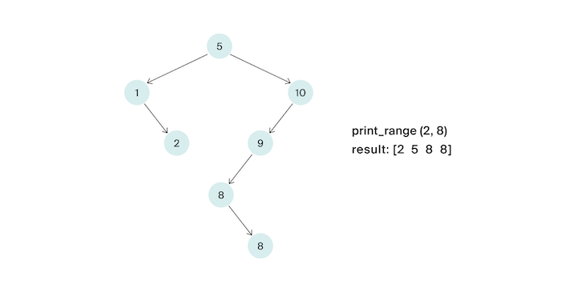

# K. Выведи диапазон

Напишите функцию, которая будет выводить по неубыванию все ключи от L до R включительно в заданном бинарном дереве поиска.

Ключи в дереве могут повторяться. Решение должно иметь сложность O(h +k), где h –— глубина дерева, k — число элементов в ответе.

В данной задаче если в узле содержится ключ x, то другие ключи, равные x, могут быть как в правом, так и в левом поддереве данного узла. (Дерево строил стажёр, так что ничего страшного).

## Формат ввода

На вход функции подаётся корень дерева и искомый ключ. Число вершин в дереве не превосходит 105.
Ключи – натуральные числа, не превосходящие 109. Гарантируется, что L ≤ R.

В итоговом решении не надо определять свою структуру / свой класс, описывающий вершину дерева.

**Замечания про отправку решений**

По умолчанию выбран компилятор make. Решение нужно отправлять в виде файла с расширением, которое соответствует вашему языку программирования. Если вы пишете на Java, имя файла должно быть Solution.java, для C# – Solution.cs. Для остальных языков назовите файл my_solution.ext, заменив ext на необходимое расширение.

Используйте заготовки кода для данной задачи, расположенные по ссылкам:

-   [c++](https://github.com/Yandex-Practicum/algorithms-templates/tree/main/cpp/sprint5/K)
-   [Java](https://github.com/Yandex-Practicum/algorithms-templates/tree/main/java/sprint5/K)
-   [js](https://github.com/Yandex-Practicum/algorithms-templates/tree/main/js/sprint5/K)
-   [python](https://github.com/Yandex-Practicum/algorithms-templates/tree/main/python/sprint5/K)
-   [c#](https://github.com/Yandex-Practicum/algorithms-templates/tree/main/csharp/sprint5/K)
-   [go](https://github.com/Yandex-Practicum/algorithms-templates/tree/main/go/sprint5/K)

## Формат вывода

Функция должна напечатать по неубыванию все ключи от L до R по одному в строке.
