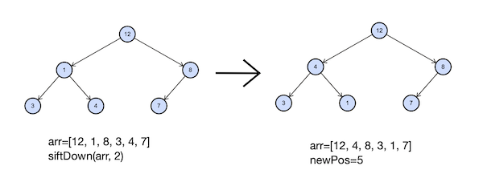

# L. Просеивание вниз

Напишите функцию, совершающую просеивание вниз в куче на максимум. Гарантируется, что порядок элементов в куче может быть нарушен только элементом, от которого запускается просеивание.

Функция принимает в качестве аргументов массив, в котором хранятся элементы кучи, и индекс элемента, от которого надо сделать просеивание вниз. Функция должна вернуть индекс, на котором элемент оказался после просеивания. Также необходимо изменить порядок элементов в переданном в функцию массиве.

Индексация в массиве, содержащем кучу, начинается с единицы. Таким образом, сыновья вершины на позиции v это 2v и 2v+1. Обратите внимание, что нулевой элемент в передаваемом массиве фиктивный, вершина кучи соответствует 1-му элементу.

## Формат ввода

Элементы кучи —– целые числа, лежащие в диапазоне от − 109 до 109. Все элементы кучи уникальны.
Передаваемый в функцию индекс лежит в диапазоне от 1 до размера передаваемого массива. В куче содержится от
1 до 105 элементов.

**Замечания про отправку решений**
По умолчанию выбран компилятор make. Решение нужно отправлять в виде файла с расширением, которое соответствует вашему языку программирования. Если вы пишете на Java, имя файла должно быть Solution.java, для C# – Solution.cs. Для остальных языков назовите файл my_solution.ext, заменив ext на необходимое расширение.

Используйте заготовки кода для данной задачи, расположенные по ссылкам:

-   [c++](https://github.com/Yandex-Practicum/algorithms-templates/tree/main/cpp/sprint5/L)
-   [Java](https://github.com/Yandex-Practicum/algorithms-templates/tree/main/java/sprint5/L)
-   [js](https://github.com/Yandex-Practicum/algorithms-templates/tree/main/js/sprint5/L)
-   [python](https://github.com/Yandex-Practicum/algorithms-templates/tree/main/python/sprint5/L)
-   [c#](https://github.com/Yandex-Practicum/algorithms-templates/tree/main/csharp/sprint5/L)
-   [go](https://github.com/Yandex-Practicum/algorithms-templates/tree/main/go/sprint5/L)
